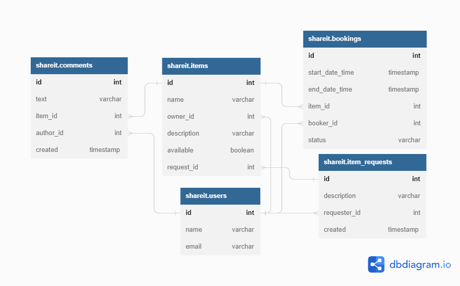

# Java Share It.
Shareit project.

1. Инструкция по запуску
* Для тестов обоих сервисов используется база данных H2, её настройки хранятся в папке /test/resources  
  Можно запускать тесты по одному, можно весь тестовый класс, можно "Run All Tests"
* Команда "docker-compose up" запускает оба сервиса и бд
* Чтобы запустить сервер (через main) нужна запущенная бд Postgres. С помощью
  pgAdmin4 создайте новую бд и внесите её название, имя пользователя и пароль в настройки /main/resources
* Gateway можно просто запустить через main
2. Технологии 
Java 11, Spring Boot, Maven, Hibernate, JUnit, MockMvc, PostgreSQL, Docker, REST, Lombok

3. Схема базы данных  

4. Описание проекта
  Приложение представляет собой сервис для шеринга (от англ. share — «делиться») вещей. Он должен обеспечить 
  пользователям, во-первых, возможность рассказывать, какими вещами они готовы поделиться, а во-вторых, находить нужную 
  вещь и брать её в аренду на какое-то время. Сервис должен не только позволять бронировать вещь на определённые даты, 
  но и закрывать к ней доступ на время бронирования от других желающих. На случай, если нужной вещи на сервисе нет, у 
  пользователей должна быть возможность оставлять запросы. Вдруг древний граммофон, который странно даже предлагать к
  аренде, неожиданно понадобится для театральной постановки. По запросу можно будет добавлять новые вещи для шеринга.  
  Микросервисная архитектура:
  * Основной модуль (Server) связан с бд и выполняет основную работу сервиса
  * Дополнительный модуль (Gateway) выполняет роль шлюза и выполняет валидацию запросов, для которых не нужна бд  
  Модули общаются друг с другом через REST.